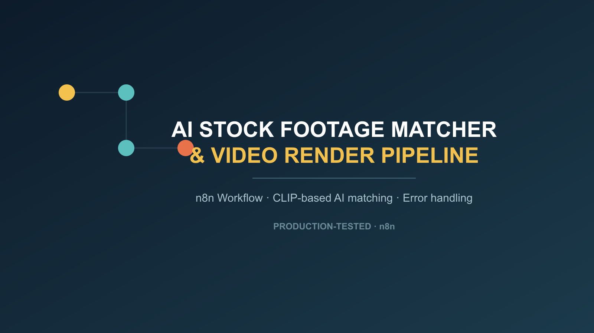

# AI Stock Footage Matcher & Video Render Pipeline

An n8n workflow that turns an approved script into a fully rendered video: it fetches stock footage candidates per script line (Pexels/Pixabay), re-ranks them with a local CLIP model against the line's actual meaning (not just keyword matching), downloads the winning clip, and runs an FFmpeg render pass — with built-in error handling so a failed render is never shipped silently.

**Highlights**
- CLIP-based visual re-ranking (ONNX runtime, no GPU required) — picks footage that actually matches the line's subject, not just generic keyword hits
- Cross-line deduplication — avoids reusing the same clip across multiple lines in one video
- Full error-handling branch: a failed stock-fetch or render step writes a distinct status instead of failing the whole run silently

**Get it:** [AutomationWorkflows.io listing](PASTE_PRODUCT_LINK_HERE)

*(Full template file is delivered on purchase — this repo is a portfolio showcase, not the download.)*
