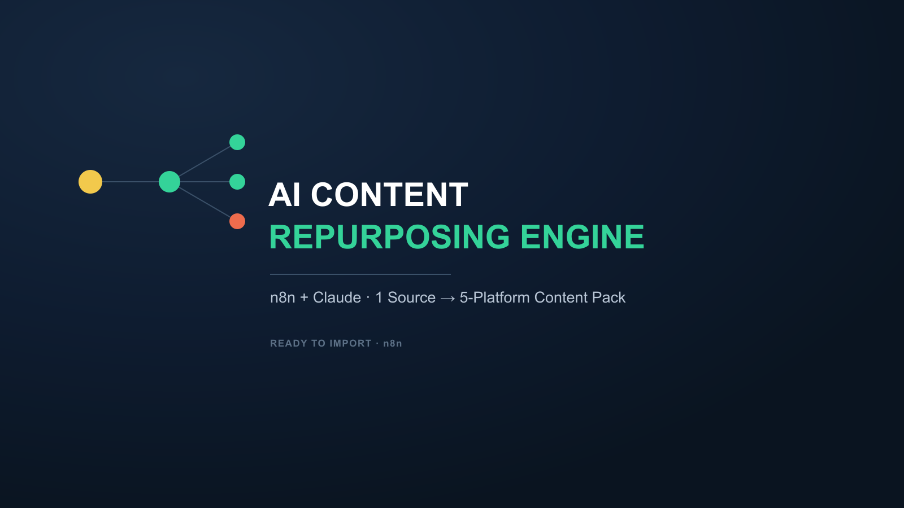

# AI Content Repurposing Engine

An n8n + Claude workflow that turns one long-form source (a video transcript, podcast transcript, or article) into a full multi-platform content pack: 3-5 source-grounded angles, each turned into a short-form video script, a LinkedIn post, a tweet, and an Instagram caption.

**Highlights**
- Anti-hallucination by design: every generated angle must cite the exact quote/moment from the source it's grounded in
- One angle → four platform-native formats, each following that platform's actual conventions (not the same text pasted four times)
- Strict output validation — a malformed or incomplete Claude response fails loudly instead of writing a broken row

**Get it:** listing coming soon on AutomationWorkflows.io

*(Full template file is delivered on purchase — this repo is a portfolio showcase, not the download.)*
