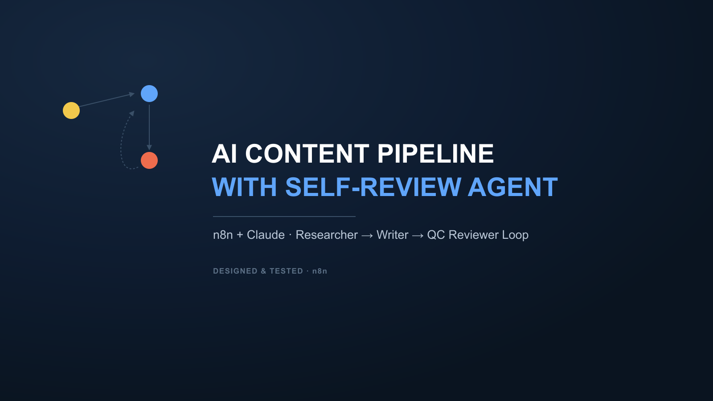

# AI Content Pipeline with Self-Reviewing Agent

A genuine multi-agent n8n pipeline: a Researcher agent finds a compelling angle, a Writer agent drafts the content, and a Reviewer agent grades it against 5 explicit quality checks — triggering one revision pass if it fails, before it ever reaches your Sheet. Not a single "write me content" prompt — an actual QA loop.

**Highlights**
- 3 chained Claude agents (Researcher → Writer → Reviewer), each with its own focused system prompt
- The Reviewer grades against 5 explicit criteria (hook strength, brief coverage, rhythm variation, closing loop, tone) — PASS/FAIL with a reason for each
- One capped revision pass — reliability over open-ended autonomous looping
- Every output row includes the QC verdict and notes, not just the final content, so nothing is a black box

**Get it:** [AutomationWorkflows.io listing](https://automationworkflows.io/product/ai-content-pipeline-with-self-reviewing-agent-researcher-writer-qc-loop-n8n-claude)

*(Full template file is delivered on purchase — this repo is a portfolio showcase, not the download.)*
