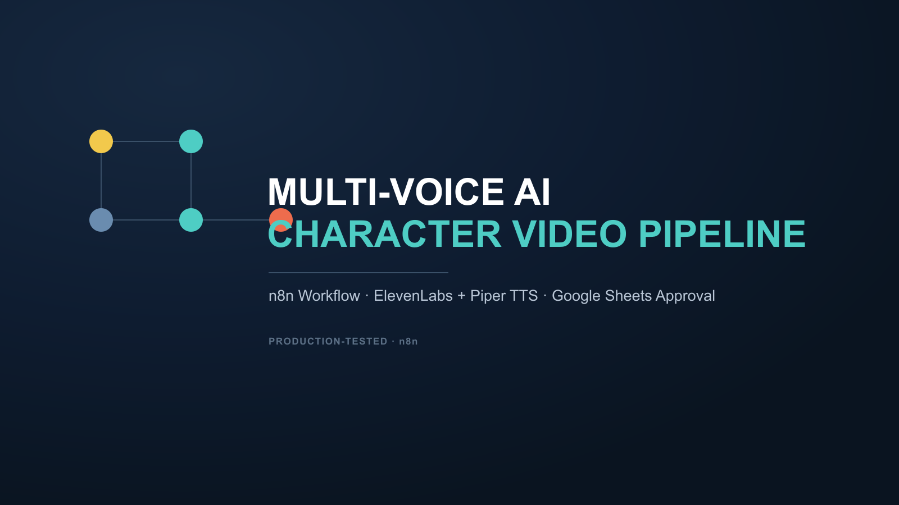

# Multi-Voice AI Character Video Generator

An n8n workflow that turns a multi-character script into a fully narrated video. Each character's voice is looked up from a mapping sheet and generated via ElevenLabs (with word-level timestamp extraction for karaoke-style captions), with an automatic fallback to free, local Piper TTS for a second language — no extra API cost for bilingual content.

**Highlights**
- Multi-character voice mapping via Google Sheets — add a new character by adding a row, no code changes
- Dual TTS engine: ElevenLabs (primary) + Piper TTS (free, local, phoneme-aligned) for a second language
- Supports pre-made song lines (paste a Suno/Udio URL) spliced directly into the narration sequence
- Full error handling: a failed render writes a distinct status back to the Sheet instead of failing silently

**Get it:** [AutomationWorkflows.io listing](PASTE_PRODUCT_LINK_HERE)

*(Full template file is delivered on purchase — this repo is a portfolio showcase, not the download.)*
