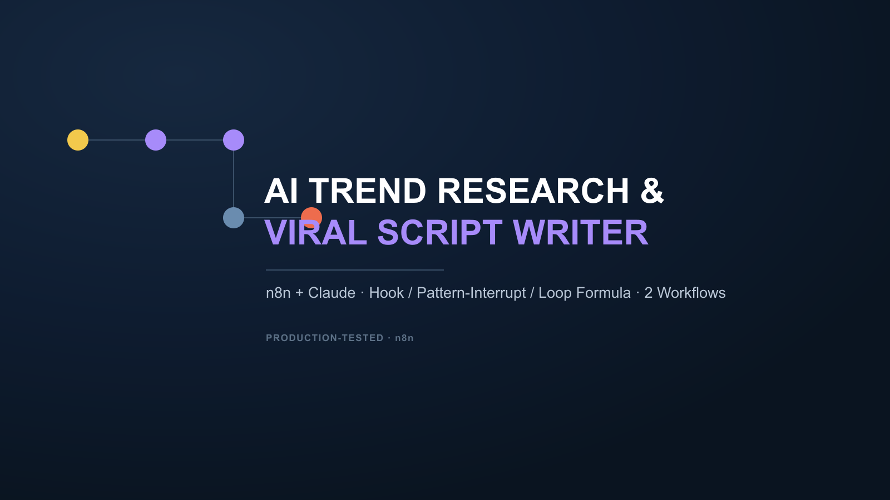

# AI Trend Research & Viral Script Writer

Two connected n8n workflows: one researches fresh trend topics with Claude (dedup-aware — it reads your content history and never repeats a past topic), the other turns each topic into a retention-optimized short-form script using a real hook / pattern-interrupt / loop-closing formula, plus an auto-generated title, description, and hashtags.

**Highlights**
- Dedup-aware trend research — Claude sees your existing topic history and is explicitly instructed to avoid repeating it
- A production-refined script formula: bold-claim/question opening, a mid-script "pattern interrupt" line placed where Shorts retention typically dips, deliberate line-length variation, and a closing line that loops back to the opening
- Fully self-contained — only needs Google Sheets + an Anthropic API key, no external render script required

**Get it:** [AutomationWorkflows.io listing](PASTE_PRODUCT_LINK_HERE)

*(Full template files are delivered on purchase — this repo is a portfolio showcase, not the download.)*
